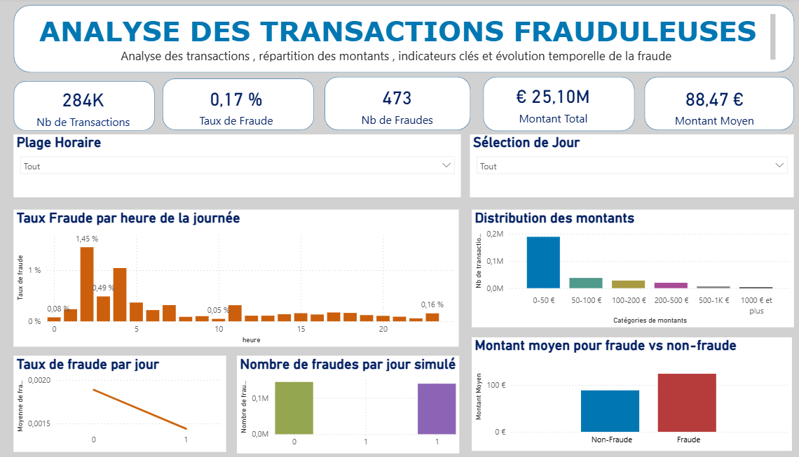

#  Analyse des Transactions Frauduleuses  
### Projet Data Analytics — Python, Power BI & Pipeline d’Automatisation

Ce projet a été conçu pour renforcer des compétences clés en **ETL**, **analyse exploratoire**, **visualisation**, et **automatisation data**.  
Il s’appuie sur un dataset de transactions bancaires afin d’identifier et comprendre les comportements frauduleux, analyser les montants, les périodes critiques et les principaux indicateurs de risque.

---
##  Aperçu du Dashboard Power BI

*(L’aperçu est fourni car le fichier `.pbix` n’est pas inclus dans le repo pour des raisons de taille)*



---

##  Objectifs du projet

- Nettoyer et préparer un dataset de transactions bancaires  
- Explorer les schémas de fraude (montants, heures, fréquence)  
- Construire un **dashboard Power BI interactif**  
- Automatiser un pipeline Python (chargement → transformation → export)  
- Présenter un workflow complet proche d’un cas réel en entreprise  

---

##  Structure du projet

``` fraude-bancaire
│
├── data/
│ ├── raw/ # Données brutes (ignorées par Git)
│ ├── processed/ # Données nettoyées (ignorées par Git)
│
├── notebooks/
│ ├── 01_etl_cleaning.ipynb # Nettoyage & préparation (ETL)
│ ├── 02_eda_visualisation.ipynb # Analyse exploratoire (EDA)
│
├── src/
│ ├── pipeline/
│ │ ├── pipeline.py # Pipeline automatisé (ETL → CSV)
│
├── reports/
│ ├── dashboard.png # Aperçu du dashboard Power BI
│ └── (dashboard.pbix ignoré car trop volumineux)
│
├── run_pipeline.bat # Exécution du pipeline en un clic
├── requirements.txt # Dépendances Python
├── .gitignore # Fichiers exclus du repository
└── README.md # Documentation du projet
```

---

##  1. ETL — Nettoyage & Préparation des données

Les étapes appliquées dans *01_etl_cleaning.ipynb* :

- Gestion des valeurs manquantes  
- Normalisation des colonnes  
- Création de variables :
  - `heure`
  - `jour_simule`
  - `amount_category`
- Détection d’anomalies  
- Export vers `fraude_clean.csv`

➡️ Ces transformations sont intégrées dans le pipeline Python pour automatiser le processus.

---

##  2. EDA — Analyse Exploratoire

Réalisée dans *02_eda_visualisation.ipynb* :

- Distribution des montants  
- Analyse temporelle (heures / jours)  
- Comparaison fraude vs non-fraude  
- Détection de patterns suspects  

Bibliothèques utilisées : `pandas`, `numpy`, `matplotlib`, `seaborn`.

---

##  3. Dashboard Power BI

### Le dashboard final contient 4 pages :

####  Page 1 — Vue d’ensemble
- KPIs : Nb transactions, nb fraudes, taux de fraude, montant total, montant moyen  
- Histogramme des fraudes par heure  
- Filtres interactifs (heure, jour simulé)

####  Page 2 — Analyse temporelle
- Fraudes par heure  
- Fraudes par jour  
- Analyse des fluctuations

####  Page 3 — Analyse des montants
- Distribution des montants  
- Fraudes par catégorie €  
- Montant moyen frauduleux vs non frauduleux  

####  Page 4 — Synthèse finale
- Tous les éléments clés réunis sur une seule page

---

##  4. Pipeline Python Automatisé

Le script *pipeline.py* exécute automatiquement :

1. Chargement des données brutes  
2. Nettoyage et transformations  
3. Enrichissement des variables  
4. Export final dans `data/processed`  
5. Ajout d’un système **logging**  
6. Gestion d'erreurs robuste  

**Exécution** :
python src/pipeline/pipeline.py

Ou via le script windows :
run_pipeline.bat


---

##  requirements.txt

pandas
numpy
matplotlib
seaborn

## Gestion des fichiers ignorés (.gitignore)

Certains fichiers ne sont volontairement **pas inclus** dans ce repository :

### 1. Confidentialité & Poids
- `data/raw/`  
- `data/processed/`  
➡️ Ces dossiers peuvent contenir des données volumineuses et ne doivent pas être versionnés.

### 2. Taille du fichier Power BI
- `reports/*.pbix`  
➡️ Les fichiers Power BI peuvent dépasser 100 Mo et ne sont pas acceptés par GitHub.  
Un aperçu visuel (`dashboard.png`) est fourni à la place.

### 3. Fichiers techniques et temporaires
- `logs/`  
- `**/.ipynb_checkpoints/`  
➡️ Dossiers générés automatiquement par Jupyter et par le pipeline.

## Architecture du workflow :
```
Données brutes 
      ↓
Pipeline ETL (Python)
      ↓
Données nettoyées
      ↓
Analyse exploratoire (notebooks)
      ↓
Dashboard Power BI
      ↓
Documentation GitHub
```
##  Contact :

Si vous souhaitez discuter du projet, obtenir la version complète du dashboard ou échanger sur une opportunité d’alternance :
    * Email : ameuraouf99@gmail.com
    * linkdin : https://www.linkedin.com/in/aouf-mohamed-ameur-4670162a3/
    
Je suis ouvert aux opportunités dans les domaines :

- Data Analyst
- Data Engineering 
- Business Intelligence

### Remerciements : 

Merci de votre intérêt pour ce projet !
J’ai réalisé ce travail pour progresser dans le domaine de la data et me rapprocher de mon objectif professionnel : intégrer une alternance dans le domaine Data.


